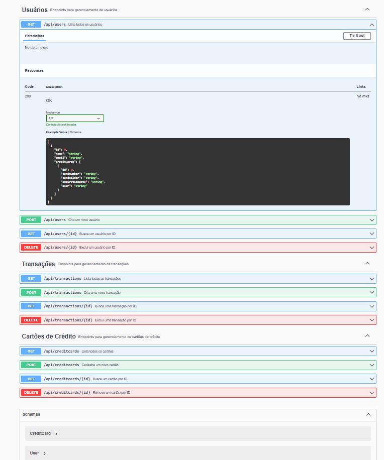
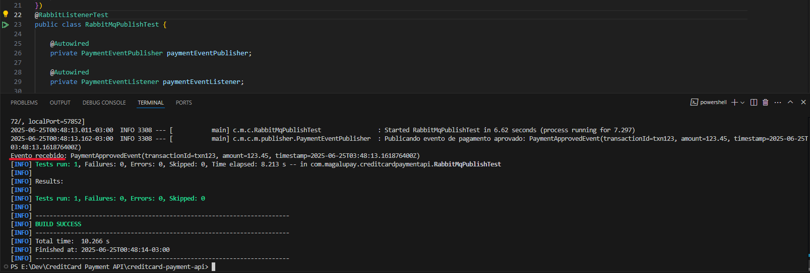
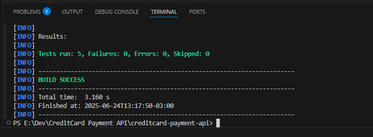

# Projeto: CreditCard Payment API (MagaluPay)

---

## 💳 Backend de Pagamentos com Cartão de Crédito

Este projeto é uma **API RESTful** desenvolvida com **Java 17 + Spring Boot** que simula funcionalidades básicas de cartões de crédito. A aplicação é modular, testável e pronta para expansão. Foi criada com foco nas **boas práticas de mercado** para atender aos padrões de qualidade exigidos por empresas como o **MagaluPay**.

---

## 🚀 Tecnologias Utilizadas

| Tecnologia               | Finalidade                                    |
|-------------------------|----------------------------------------------|
| Java 17                 | Linguagem principal                           |
| Spring Boot 3.3.13      | Framework para criação de APIs REST           |
| Spring Data JPA         | Abstração de persistência com Hibernate       |
| PostgreSQL              | Banco de dados relacional                      |
| JUnit + Mockito         | Testes unitários e de serviço                  |
| Springdoc OpenAPI       | Documentação Swagger                           |
| Spring Boot Actuator    | Monitoramento e métricas                       |
| Docker + Docker Compose | Containerização da aplicação e do banco       |
| Maven                   | Gerenciamento de dependências e build         |

---

## 🧱 Estrutura do Projeto

```
src/
 └── main/
      └── java/
           └── com.magalupay.creditcardpaymentapi/
                ├── model/          # Entidades JPA: User, CreditCard, Transaction
                ├── repository/     # Interfaces JpaRepository
                ├── service/        # Regras de negócio
                ├── controller/     # Endpoints REST
                └── CreditcardPaymentApiApplication.java
```

---

## ✅ Funcionalidades Implementadas

### 📁 Entidades (model)

- `User`: Nome, e-mail, lista de cartões.
- `CreditCard`: Número do cartão, titular, validade, relacionamento com User.
- `Transaction`: Valor, data/hora, vínculo com um cartão.

### 📦 Repositórios (repository)

- `UserRepository`
- `CreditCardRepository`
- `TransactionRepository`

Todos estendem `JpaRepository`, com suporte a operações básicas de persistência.

### ⚙️ Serviços (service)

- `UserService`, `CreditCardService`, `TransactionService` com:
  - CRUD completo
  - Injeção de dependência
  - Validações básicas

### 🌐 Controladores REST (controller)

- Endpoints REST para:
  - Criar, buscar, listar e deletar usuários
  - Criar e gerenciar cartões de crédito
  - Registrar e listar transações

### ✅ Testes Automatizados

- Testes com `JUnit` e `Mockito` funcionando:
  - Teste de contexto da aplicação
  - Testes de serviço para `CreditCardService`

### 🐳 Docker

- **Docker Compose** configurado com:
  - PostgreSQL
  - App backend
- Aplicação roda perfeitamente conectada ao banco via container

### 📄 Swagger (Documentação Automática)

- Integração com Springdoc OpenAPI
- Documentação dos endpoints REST gerada automaticamente em `/swagger-ui.html`



---

## 🐇 Mensageria - RabbitMQ

- Implementação do fluxo de mensageria para comunicação assíncrona via RabbitMQ, possibilitando desacoplamento entre componentes do sistema.
- Configuração do publisher para envio de eventos de pagamento aprovados, garantindo que notificações sejam enviadas de forma confiável.
- Desenvolvimento do consumer que escuta as mensagens da fila, processando eventos recebidos para ações subsequentes.
- Criação de testes automatizados que validam a publicação e o consumo dos eventos, garantindo a integridade do fluxo de mensagens durante a execução da aplicação.
- Demonstração prática do funcionamento via teste integrado, evidenciada pela imagem do teste RabbitMQ executado com sucesso:



---

## 🧪 Testes Realizados

Os testes automatizados garantem que os principais serviços da aplicação estão funcionando corretamente, mesmo após alterações no código. Eles ajudam a evitar regressões e facilitam a manutenção do sistema.

Foram utilizados testes unitários com o framework JUnit 5 e Mockito para simular comportamentos dos repositórios e validar o funcionamento isolado das regras de negócio.

Comando executado:

```bash
mvn clean install
```

Resultado esperado:

```yaml
BUILD SUCCESS
Tests run: 5, Failures: 0, Errors: 0
```


---

## 📌 O que pode ser feito a seguir

| Tarefa                              | Status |
|-----------------------------------|--------|
| Implementar autenticação com JWT    | 🔜     |
| Criar testes para UserService e TransactionService | 🔜 |
| Adicionar validações de dados (ex: regex para e-mail) | 🔜 |
| Tratamento global de exceções com `@ControllerAdvice` | 🔜 |
| Criar DTOs para desacoplamento entre entidade e API | 🔜 |
| Testes de integração com banco H2 | 🔜     |
| Mensageria simulada (RabbitMQ ou Kafka) | 🔜   |

---

## 👤 Desenvolvedor

**Lucas Gabriel Likes**  
Engenheiro de Software Júnior  
📞 (41) 98403-6744  
🔗 [GitHub](https://github.com/LucasLikes) | [LinkedIn](https://www.linkedin.com/in/lucas-gabriel-likes-06a2b9182/)
